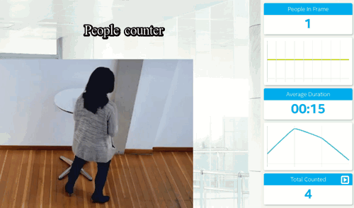

# Project Write-Up

## Explaining Custom Layers

OpenVINO supports neural network model layers in multiple frameworks. Custom layers are layers that are not included in the list of known layers.

The inference engine loads the layers of the input model's IR files into the specified device plug-in, which will look for a list of known layer implementations for the device. If the neural network model contains layers that are not in the list of known layers of the device, the inference engine considers that the layer is not supported and reports an error.

In this case, the custom layer extension must be added / created. Find more information about the process in the Openvino documentation here: https://docs.openvinotoolkit.org/latest/_docs_HOWTO_Custom_Layers_Guide.html

## Comparing Model Performance

Many models have been tested in order to find one that has sufficient precision for the project, and if possible, equivalent to or better than the pre-trained Openvino models.

Benchmark of the tests:

<table>
  <tr>
    <th rowspan="2">Framework</th>
    <th rowspan="2">Model</th>
    <th colspan="3">Inference time (ms)</th>
    <th rowspan="2">Accuracy</th>
    <th colspan="3">FPS</th>
  </tr>
  <tr>
    <th>CPU</th>
    <th>GPU</th>
    <th>VPU</th>    
    <th>CPU</th>
    <th>GPU</th>
    <th>VPU</th>
  </tr>
  <tr>
    <td>Pytorch</td>
    <td>Yolo v3</td>
    <td>84</td>
    <td>-</td>
    <td>-</td>    
    <td>High</td>
    <td>12</td>
    <td>-</td>
    <td>-</td>
  </tr>
  <tr>
    <td>Openvino (TF)</td>
    <td>SSD Inception v2 coco</td>
    <td>22</td>
    <td>41</td>
    <td>75</td>
    <td>Low</td>
    <td>45</td>
    <td>24</td>
    <td>13</td>
  </tr>
  <tr>
  <td>Openvino (TF)</td>
  <td>SSD Mobilenet v1 coco</td>
  <td>254</td>
  <td>-</td>
  <td>-</td>
  <td>Low</td>
  <td>4</td>
  <td>-</td>
  <td>-</td>
  </tr>
  <tr>
  <td>Openvino</td>
  <td>Retail-0013</td>
  <td>8</td>
  <td>12</td>
  <td>129</td>
  <td>High</td>
  <td>125</td>
  <td>83</td>
  <td>8</td>
  </tr>
  <tr>
  <td>Openvino (TF)</td>
  <td>SSD Resnet 50</td>
  <td>356</td>
  <td>-</td>
  <td>-</td>
  <td>Very Low</td>
  <td>3</td>
  <td>-</td>
  <td>-</td>
  </tr>
  <tr>
  <td>Openvino (TF)</td>
  <td>SSD Mobilenet v2 coco</td>
  <td>12</td>
  <td>24</td>
  <td>63</td>
  <td>Low</td>
  <td>83</td>
  <td>41</td>
  <td>16</td>
  </tr>
  <tr>
  <td>Openvino (TF)</td>
  <td>Yolo v3</td>
  <td>40-130 (1)</td>
  <td>20-380 (1)</td>
  <td>24-192 (1)</td>
  <td>Low</td>
  <td><10</td>
  <td><10</td>
  <td><10</td>
  </tr>
  <tr>
  <td>Openvino (TF)</td>
  <td>TinyYolo v3</td>
  <td>21</td>
  <td>22</td>
  <td>61</td>
  <td>Very Low</td>
  <td>48</td>
  <td>45</td>
  <td>16</td>
  </tr>
</table>

*The benchmark was made on an i7 8700 CPU, an HD630 iGPU and an Neural Compute Stick (NCS2) VPU.*  

Only Yolo v3 on pytorch met the requirements. It is slower than the Openvino Retail-0013 but the FPS is still sufficient (the demo video rate turns at 10 FPS).
Unfortunately, the Yolo v3 Pytorch model cannot be converted (at least for the 2019.3 version of Openvino).

A Tensorflow version of Yolo was converted and tested, but the result was disappointing: the precision went from High to Low and the FPS was well below 10 FPS.

For verification, the demo provided by Intel for Yolo was tested but the result was the same.

(1) The variability of the results given for Yolo comes from the difference in the place of measurement (whether or not taking pre / post treatment into account). The slowdown factor does not seem to come from the inference time but from the pre and post processing (certainly due to the complexity of the model). There is certainly room for improvement on this path.

So, finally, the Retail-0013 model was selected. This model has been trained and optimized (from SSD mobilenet v2) for the task and has a very good accuracy / FPS rate.

**Model size modification by openvino optimizer process:**
<table>
  <tr>
    <th >Model</th>
    <th >Before</th>
    <th >After</th>

  </tr>
  <tr>
    <td>Yolo v3</td>
    <td>248.2 Mo</td>
    <td>247.7 Mo</td>
  </tr>
  <tr>
    <td>SSD Resnet 50</td>
    <td>134.3 Mo</td>
    <td>206.7 Mo</td>
  </tr>
  <tr>
    <td>SSD Mobilenet v2 coco</td>
    <td>69.7 Mo</td>
    <td>67.3 Mo</td>
  </tr>
</table>

**Advantage of running AI to the EDGE (vs Cloud):**
* Cost saving: for a 24/7 service (video surveillance), the cost is greatly reduced
* No need costly network (in term of budget and computer ressource consumption)
* Better security of data

## Assess Model Use Cases

Some of the potential use cases of the people counter app are :

* **Smart city** : Installation of temporary or permanent cameras to improve infrastructure and services. (for example, improving pedestrian traffic). This type of edge application allows more data to be processed automatically and in real time. In this case, the "Smart" camera with integrated VPU should be the best choice to limit the network speed and respect confidentiality ...

* **Marketing** : For retail, this could help adapt to the flow of customers more reactively and also store data to create predictive models. A camera placed at the entrance or at another convenient location could send video stream to a computer in charge of the calculation (at the edge).

## Assess Effects on End User Needs

Lighting, model accuracy, and camera focal length/image size have different effects on a
deployed edge model. The potential effects are:
* A large change in lightning could affect the accuracy of the model. If possible, this should be avoided. If this cannot be avoided, the model could be adapted by specific training to avoid any loss of precision.
* The precision of the model depends on the customer's requirements: precision or budgetary priority? speed or better accuracy? ... any questions that needs to be taken into account at the start of the project.
* The choice of camera will affect model accuracy and calculation requirements, as well as the budget. Like for the precision of the model, all this must be taken into account at the beginning of  the project.

## Model Research

In investigating potential people counter models, I tried each of the following three models:

- Model 1: **Yolo v3**
  - Model Source: https://pjreddie.com/media/files/yolov3.weights
  - I converted the model to an Intermediate Representation with the following arguments:
        `python3 mo_tf.py
        --input_model <path_to>/yolo_v3.pb
        --tensorflow_use_custom_operations_config <path_to>/yolo_v3.json
        --batch 1`

  - The model was insufficient for the app because of his low accuracy and low FPS rate.
  - I tried to improve the model for the app by modifying accuracy threshold and testing different platform (CPU, GPU, VPU).

- Model 2: **SSD Resnet 50**
  - Model Source: http://download.tensorflow.org/models/object_detection/ssd_resnet50_v1_fpn_shared_box_predictor_640x640_coco14_sync_2018_07_03.tar.gz
  - I converted the model to an Intermediate Representation with the following arguments:
        `python <path_to>/mo.py --input_model <path_to>/frozen_inference_graph.pb \
        --tensorflow_object_detection_api_pipeline_config <path_to>/pipeline.config \
        --reverse_input_channels \
        --tensorflow_use_custom_operations_config <path_to>/ssd_v2_support.json`

  - The model was insufficient for the app because of his very low accuracy and inacurate FPS rate.
  - I tried to improve the model for the app by modifying accuracy threshold and testing different platform (CPU, GPU, VPU).

- Model 3: **SSD Mobilenet v2**
  - Model Source: http://download.tensorflow.org/models/object_detection/ssd_mobilenet_v2_coco_2018_03_29.tar.gz
  - I converted the model to an Intermediate Representation with the following arguments:
        `python <path_to>/mo.py --input_model <path_to>/frozen_inference_graph.pb \
        --tensorflow_object_detection_api_pipeline_config <path_to>/pipeline.config \
        --reverse_input_channels \
        --tensorflow_use_custom_operations_config <path_to>/ssd_v2_support.json`

  - The model was insufficient for the app because of his low accuracy.
  - I tried to improve the model for the app by modifying accuracy threshold and testing different platform (CPU, GPU, VPU).
